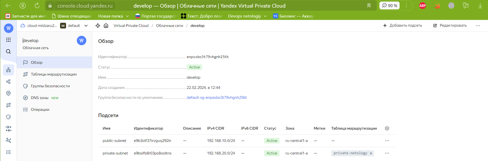

# Домашнее задание к занятию «Организация сети»

### Подготовка к выполнению задания

1. Домашнее задание состоит из обязательной части, которую нужно выполнить на провайдере Yandex Cloud, и дополнительной части в AWS (выполняется по желанию). 
2. Все домашние задания в блоке 15 связаны друг с другом и в конце представляют пример законченной инфраструктуры.  
3. Все задания нужно выполнить с помощью Terraform. Результатом выполненного домашнего задания будет код в репозитории. 
4. Перед началом работы настройте доступ к облачным ресурсам из Terraform, используя материалы прошлых лекций и домашнее задание по теме «Облачные провайдеры и синтаксис Terraform». Заранее выберите регион (в случае AWS) и зону.

---
### Задание 1. Yandex Cloud 

**Что нужно сделать**

1. Создать пустую VPC. Выбрать зону.
2. Публичная подсеть.

<details>
<summary>VPC</summary>



</details>


<details>
<summary>terraform plan</summary>

```shell
zag1988@mytest-6:~/clopro-homeworks/clopro-homeworks 15.1/terraform$ terraform plan
var.cloud_id
  b1g6a0ordi02m0u7i976

  Enter a value: yes

var.folder_id
  b1g7uad4bpp6ioe1fc7h

  Enter a value: yes

data.yandex_compute_image.nat-ubuntu: Reading...
data.yandex_compute_image.private-ubuntu: Reading...
data.yandex_compute_image.ubuntu: Reading...
data.yandex_compute_image.nat-ubuntu: Read complete after 0s [id=fd883hg3q7olkoc30kav]
data.yandex_compute_image.ubuntu: Read complete after 0s [id=fd8t8vqitgjou20saanq]
data.yandex_compute_image.private-ubuntu: Read complete after 0s [id=fd8t8vqitgjou20saanq]

Terraform used the selected providers to generate the following execution plan. Resource actions are indicated with the following symbols:
  + create

Terraform will perform the following actions:

  # yandex_compute_instance.nat-instance will be created
  + resource "yandex_compute_instance" "nat-instance" {
      + created_at                = (known after apply)
      + folder_id                 = (known after apply)
      + fqdn                      = (known after apply)
      + gpu_cluster_id            = (known after apply)
      + hostname                  = "nat"
      + id                        = (known after apply)
      + maintenance_grace_period  = (known after apply)
      + maintenance_policy        = (known after apply)
      + metadata                  = {
          + "ssh-keys" = <<-EOT
                ubuntu:ssh-ed25519 AAAAC3NzaC1lZDI1NTE5AAAAIBxjMXmCpJt4r0xCmn5Lw4aqHw6HFfpgLNxoYySdxzyl midzaru2011@yandex.ru
            EOT
        }
      + name                      = "nat"
      + network_acceleration_type = "standard"
      + platform_id               = "standard-v1"
      + service_account_id        = (known after apply)
      + status                    = (known after apply)
      + zone                      = (known after apply)

      + boot_disk {
          + auto_delete = true
          + device_name = (known after apply)
          + disk_id     = (known after apply)
          + mode        = (known after apply)

          + initialize_params {
              + block_size  = (known after apply)
              + description = (known after apply)
              + image_id    = "fd883hg3q7olkoc30kav"
              + name        = (known after apply)
              + size        = (known after apply)
              + snapshot_id = (known after apply)
              + type        = "network-hdd"
            }
        }

      + network_interface {
          + index              = (known after apply)
          + ip_address         = "192.168.10.254"
          + ipv4               = true
          + ipv6               = (known after apply)
          + ipv6_address       = (known after apply)
          + mac_address        = (known after apply)
          + nat                = true
          + nat_ip_address     = (known after apply)
          + nat_ip_version     = (known after apply)
          + security_group_ids = (known after apply)
          + subnet_id          = (known after apply)
        }

      + resources {
          + core_fraction = 20
          + cores         = 2
          + memory        = 2
        }

      + scheduling_policy {
          + preemptible = true
        }
    }

  # yandex_compute_instance.private-instance will be created
  + resource "yandex_compute_instance" "private-instance" {
      + created_at                = (known after apply)
      + folder_id                 = (known after apply)
      + fqdn                      = (known after apply)
      + gpu_cluster_id            = (known after apply)
      + hostname                  = "private"
      + id                        = (known after apply)
      + maintenance_grace_period  = (known after apply)
      + maintenance_policy        = (known after apply)
      + metadata                  = {
          + "ssh-keys" = <<-EOT
                ubuntu:ssh-ed25519 AAAAC3NzaC1lZDI1NTE5AAAAIBxjMXmCpJt4r0xCmn5Lw4aqHw6HFfpgLNxoYySdxzyl midzaru2011@yandex.ru
            EOT
        }
      + name                      = "private"
      + network_acceleration_type = "standard"
      + platform_id               = "standard-v1"
      + service_account_id        = (known after apply)
      + status                    = (known after apply)
      + zone                      = (known after apply)

      + boot_disk {
          + auto_delete = true
          + device_name = (known after apply)
          + disk_id     = (known after apply)
          + mode        = (known after apply)

          + initialize_params {
              + block_size  = (known after apply)
              + description = (known after apply)
              + image_id    = "fd8t8vqitgjou20saanq"
              + name        = (known after apply)
              + size        = (known after apply)
              + snapshot_id = (known after apply)
              + type        = "network-hdd"
            }
        }

      + network_interface {
          + index              = (known after apply)
          + ip_address         = (known after apply)
          + ipv4               = true
          + ipv6               = (known after apply)
          + ipv6_address       = (known after apply)
          + mac_address        = (known after apply)
          + nat                = false
          + nat_ip_address     = (known after apply)
          + nat_ip_version     = (known after apply)
          + security_group_ids = (known after apply)
          + subnet_id          = (known after apply)
        }

      + resources {
          + core_fraction = 20
          + cores         = 2
          + memory        = 2
        }

      + scheduling_policy {
          + preemptible = true
        }
    }

  # yandex_compute_instance.public-instance will be created
  + resource "yandex_compute_instance" "public-instance" {
      + created_at                = (known after apply)
      + folder_id                 = (known after apply)
      + fqdn                      = (known after apply)
      + gpu_cluster_id            = (known after apply)
      + hostname                  = "public"
      + id                        = (known after apply)
      + maintenance_grace_period  = (known after apply)
      + maintenance_policy        = (known after apply)
      + metadata                  = {
          + "ssh-keys" = <<-EOT
                ubuntu:ssh-ed25519 AAAAC3NzaC1lZDI1NTE5AAAAIBxjMXmCpJt4r0xCmn5Lw4aqHw6HFfpgLNxoYySdxzyl midzaru2011@yandex.ru
            EOT
        }
      + name                      = "public"
      + network_acceleration_type = "standard"
      + platform_id               = "standard-v1"
      + service_account_id        = (known after apply)
      + status                    = (known after apply)
      + zone                      = (known after apply)

      + boot_disk {
          + auto_delete = true
          + device_name = (known after apply)
          + disk_id     = (known after apply)
          + mode        = (known after apply)

          + initialize_params {
              + block_size  = (known after apply)
              + description = (known after apply)
              + image_id    = "fd8t8vqitgjou20saanq"
              + name        = (known after apply)
              + size        = (known after apply)
              + snapshot_id = (known after apply)
              + type        = "network-hdd"
            }
        }

      + network_interface {
          + index              = (known after apply)
          + ip_address         = (known after apply)
          + ipv4               = true
          + ipv6               = (known after apply)
          + ipv6_address       = (known after apply)
          + mac_address        = (known after apply)
          + nat                = true
          + nat_ip_address     = (known after apply)
          + nat_ip_version     = (known after apply)
          + security_group_ids = (known after apply)
          + subnet_id          = (known after apply)
        }

      + resources {
          + core_fraction = 20
          + cores         = 2
          + memory        = 2
        }

      + scheduling_policy {
          + preemptible = true
        }
    }

  # yandex_vpc_network.netology-network will be created
  + resource "yandex_vpc_network" "netology-network" {
      + created_at                = (known after apply)
      + default_security_group_id = (known after apply)
      + folder_id                 = (known after apply)
      + id                        = (known after apply)
      + labels                    = (known after apply)
      + name                      = "develop"
      + subnet_ids                = (known after apply)
    }

  # yandex_vpc_route_table.private-netology will be created
  + resource "yandex_vpc_route_table" "private-netology" {
      + created_at = (known after apply)
      + folder_id  = (known after apply)
      + id         = (known after apply)
      + labels     = (known after apply)
      + name       = "private-netology"
      + network_id = (known after apply)

      + static_route {
          + destination_prefix = "0.0.0.0/0"
          + next_hop_address   = "192.168.10.254"
        }
    }

  # yandex_vpc_subnet.private will be created
  + resource "yandex_vpc_subnet" "private" {
      + created_at     = (known after apply)
      + folder_id      = (known after apply)
      + id             = (known after apply)
      + labels         = (known after apply)
      + name           = "private-subnet"
      + network_id     = (known after apply)
      + route_table_id = (known after apply)
      + v4_cidr_blocks = [
          + "192.168.20.0/24",
        ]
      + v6_cidr_blocks = (known after apply)
      + zone           = "ru-central1-a"
    }

  # yandex_vpc_subnet.public will be created
  + resource "yandex_vpc_subnet" "public" {
      + created_at     = (known after apply)
      + folder_id      = (known after apply)
      + id             = (known after apply)
      + labels         = (known after apply)
      + name           = "public-subnet"
      + network_id     = (known after apply)
      + v4_cidr_blocks = [
          + "192.168.10.0/24",
        ]
      + v6_cidr_blocks = (known after apply)
      + zone           = "ru-central1-a"
    }

Plan: 7 to add, 0 to change, 0 to destroy.

Changes to Outputs:
  + vm_external_ip_address_nat     = "192.168.10.254"
  + vm_external_ip_address_private = (known after apply)
  + vm_external_ip_address_public  = (known after apply)
```

</details>


 - Создать в VPC subnet с названием public, сетью 192.168.10.0/24.
 - Создать в этой подсети NAT-инстанс, присвоив ему адрес 192.168.10.254. В качестве image_id использовать fd80mrhj8fl2oe87o4e1.

<details>
<summary>NAT-инстанс</summary>


</details>


<details>
<summary>terraform apply -auto-approve</summary>

```shell
zag1988@mytest-6:~/clopro-homeworks/clopro-homeworks 15.1/terraform$ terraform apply -auto-approve
var.cloud_id
  b1g6a0ordi02m0u7i976

  Enter a value: yes

var.folder_id
  b1g7uad4bpp6ioe1fc7h

  Enter a value: yes

data.yandex_compute_image.private-ubuntu: Reading...
data.yandex_compute_image.ubuntu: Reading...
data.yandex_compute_image.nat-ubuntu: Reading...
data.yandex_compute_image.private-ubuntu: Read complete after 0s [id=fd8t8vqitgjou20saanq]
data.yandex_compute_image.nat-ubuntu: Read complete after 0s [id=fd883hg3q7olkoc30kav]
data.yandex_compute_image.ubuntu: Read complete after 0s [id=fd8t8vqitgjou20saanq]

Terraform used the selected providers to generate the following execution plan. Resource actions are indicated with the following symbols:
  + create

Terraform will perform the following actions:

  # yandex_compute_instance.nat-instance will be created
  + resource "yandex_compute_instance" "nat-instance" {
      + created_at                = (known after apply)
      + folder_id                 = (known after apply)
      + fqdn                      = (known after apply)
      + gpu_cluster_id            = (known after apply)
      + hostname                  = "nat"
      + id                        = (known after apply)
      + maintenance_grace_period  = (known after apply)
      + maintenance_policy        = (known after apply)
      + metadata                  = {
          + "ssh-keys" = <<-EOT
                ubuntu:ssh-ed25519 AAAAC3NzaC1lZDI1NTE5AAAAIBxjMXmCpJt4r0xCmn5Lw4aqHw6HFfpgLNxoYySdxzyl midzaru2011@yandex.ru
            EOT
        }
      + name                      = "nat"
      + network_acceleration_type = "standard"
      + platform_id               = "standard-v1"
      + service_account_id        = (known after apply)
      + status                    = (known after apply)
      + zone                      = (known after apply)

      + boot_disk {
          + auto_delete = true
          + device_name = (known after apply)
          + disk_id     = (known after apply)
          + mode        = (known after apply)

          + initialize_params {
              + block_size  = (known after apply)
              + description = (known after apply)
              + image_id    = "fd883hg3q7olkoc30kav"
              + name        = (known after apply)
              + size        = (known after apply)
              + snapshot_id = (known after apply)
              + type        = "network-hdd"
            }
        }

      + network_interface {
          + index              = (known after apply)
          + ip_address         = "192.168.10.254"
          + ipv4               = true
          + ipv6               = (known after apply)
          + ipv6_address       = (known after apply)
          + mac_address        = (known after apply)
          + nat                = true
          + nat_ip_address     = (known after apply)
          + nat_ip_version     = (known after apply)
          + security_group_ids = (known after apply)
          + subnet_id          = (known after apply)
        }

      + resources {
          + core_fraction = 20
          + cores         = 2
          + memory        = 2
        }

      + scheduling_policy {
          + preemptible = true
        }
    }

  # yandex_compute_instance.private-instance will be created
  + resource "yandex_compute_instance" "private-instance" {
      + created_at                = (known after apply)
      + folder_id                 = (known after apply)
      + fqdn                      = (known after apply)
      + gpu_cluster_id            = (known after apply)
      + hostname                  = "private"
      + id                        = (known after apply)
      + maintenance_grace_period  = (known after apply)
      + maintenance_policy        = (known after apply)
      + metadata                  = {
          + "ssh-keys" = <<-EOT
                ubuntu:ssh-ed25519 AAAAC3NzaC1lZDI1NTE5AAAAIBxjMXmCpJt4r0xCmn5Lw4aqHw6HFfpgLNxoYySdxzyl midzaru2011@yandex.ru
            EOT
        }
      + name                      = "private"
      + network_acceleration_type = "standard"
      + platform_id               = "standard-v1"
      + service_account_id        = (known after apply)
      + status                    = (known after apply)
      + zone                      = (known after apply)

      + boot_disk {
          + auto_delete = true
          + device_name = (known after apply)
          + disk_id     = (known after apply)
          + mode        = (known after apply)

          + initialize_params {
              + block_size  = (known after apply)
              + description = (known after apply)
              + image_id    = "fd8t8vqitgjou20saanq"
              + name        = (known after apply)
              + size        = (known after apply)
              + snapshot_id = (known after apply)
              + type        = "network-hdd"
            }
        }

      + network_interface {
          + index              = (known after apply)
          + ip_address         = (known after apply)
          + ipv4               = true
          + ipv6               = (known after apply)
          + ipv6_address       = (known after apply)
          + mac_address        = (known after apply)
          + nat                = false
          + nat_ip_address     = (known after apply)
          + nat_ip_version     = (known after apply)
          + security_group_ids = (known after apply)
          + subnet_id          = (known after apply)
        }

      + resources {
          + core_fraction = 20
          + cores         = 2
          + memory        = 2
        }

      + scheduling_policy {
          + preemptible = true
        }
    }

  # yandex_compute_instance.public-instance will be created
  + resource "yandex_compute_instance" "public-instance" {
      + created_at                = (known after apply)
      + folder_id                 = (known after apply)
      + fqdn                      = (known after apply)
      + gpu_cluster_id            = (known after apply)
      + hostname                  = "public"
      + id                        = (known after apply)
      + maintenance_grace_period  = (known after apply)
      + maintenance_policy        = (known after apply)
      + metadata                  = {
          + "ssh-keys" = <<-EOT
                ubuntu:ssh-ed25519 AAAAC3NzaC1lZDI1NTE5AAAAIBxjMXmCpJt4r0xCmn5Lw4aqHw6HFfpgLNxoYySdxzyl midzaru2011@yandex.ru
            EOT
        }
      + name                      = "public"
      + network_acceleration_type = "standard"
      + platform_id               = "standard-v1"
      + service_account_id        = (known after apply)
      + status                    = (known after apply)
      + zone                      = (known after apply)

      + boot_disk {
          + auto_delete = true
          + device_name = (known after apply)
          + disk_id     = (known after apply)
          + mode        = (known after apply)

          + initialize_params {
              + block_size  = (known after apply)
              + description = (known after apply)
              + image_id    = "fd8t8vqitgjou20saanq"
              + name        = (known after apply)
              + size        = (known after apply)
              + snapshot_id = (known after apply)
              + type        = "network-hdd"
            }
        }

      + network_interface {
          + index              = (known after apply)
          + ip_address         = (known after apply)
          + ipv4               = true
          + ipv6               = (known after apply)
          + ipv6_address       = (known after apply)
          + mac_address        = (known after apply)
          + nat                = true
          + nat_ip_address     = (known after apply)
          + nat_ip_version     = (known after apply)
          + security_group_ids = (known after apply)
          + subnet_id          = (known after apply)
        }

      + resources {
          + core_fraction = 20
          + cores         = 2
          + memory        = 2
        }

      + scheduling_policy {
          + preemptible = true
        }
    }

  # yandex_vpc_network.netology-network will be created
  + resource "yandex_vpc_network" "netology-network" {
      + created_at                = (known after apply)
      + default_security_group_id = (known after apply)
      + folder_id                 = (known after apply)
      + id                        = (known after apply)
      + labels                    = (known after apply)
      + name                      = "develop"
      + subnet_ids                = (known after apply)
    }

  # yandex_vpc_route_table.private-netology will be created
  + resource "yandex_vpc_route_table" "private-netology" {
      + created_at = (known after apply)
      + folder_id  = (known after apply)
      + id         = (known after apply)
      + labels     = (known after apply)
      + name       = "private-netology"
      + network_id = (known after apply)

      + static_route {
          + destination_prefix = "0.0.0.0/0"
          + next_hop_address   = "192.168.10.254"
        }
    }

  # yandex_vpc_subnet.private will be created
  + resource "yandex_vpc_subnet" "private" {
      + created_at     = (known after apply)
      + folder_id      = (known after apply)
      + id             = (known after apply)
      + labels         = (known after apply)
      + name           = "private-subnet"
      + network_id     = (known after apply)
      + route_table_id = (known after apply)
      + v4_cidr_blocks = [
          + "192.168.20.0/24",
        ]
      + v6_cidr_blocks = (known after apply)
      + zone           = "ru-central1-a"
    }

  # yandex_vpc_subnet.public will be created
  + resource "yandex_vpc_subnet" "public" {
      + created_at     = (known after apply)
      + folder_id      = (known after apply)
      + id             = (known after apply)
      + labels         = (known after apply)
      + name           = "public-subnet"
      + network_id     = (known after apply)
      + v4_cidr_blocks = [
          + "192.168.10.0/24",
        ]
      + v6_cidr_blocks = (known after apply)
      + zone           = "ru-central1-a"
    }

Plan: 7 to add, 0 to change, 0 to destroy.

Changes to Outputs:
  + vm_external_ip_address_nat     = "192.168.10.254"
  + vm_external_ip_address_private = (known after apply)
  + vm_external_ip_address_public  = (known after apply)
yandex_vpc_network.netology-network: Creating...
yandex_vpc_network.netology-network: Creation complete after 1s [id=enpssbo3t79vhgnh256t]
yandex_vpc_subnet.public: Creating...
yandex_vpc_subnet.public: Creation complete after 1s [id=e9b3olf37irvguq292tr]
yandex_compute_instance.public-instance: Creating...
yandex_compute_instance.nat-instance: Creating...
yandex_compute_instance.public-instance: Still creating... [10s elapsed]
yandex_compute_instance.nat-instance: Still creating... [10s elapsed]
yandex_compute_instance.nat-instance: Still creating... [20s elapsed]
yandex_compute_instance.public-instance: Still creating... [20s elapsed]
yandex_compute_instance.public-instance: Still creating... [30s elapsed]
yandex_compute_instance.nat-instance: Still creating... [30s elapsed]
yandex_compute_instance.public-instance: Still creating... [40s elapsed]
yandex_compute_instance.nat-instance: Still creating... [40s elapsed]
yandex_compute_instance.public-instance: Still creating... [50s elapsed]
yandex_compute_instance.nat-instance: Still creating... [50s elapsed]
yandex_compute_instance.public-instance: Still creating... [1m0s elapsed]
yandex_compute_instance.nat-instance: Still creating... [1m0s elapsed]
yandex_compute_instance.public-instance: Creation complete after 1m8s [id=fhmto9og6b206sk0kja4]
yandex_compute_instance.nat-instance: Creation complete after 1m9s [id=fhmph9epumkpcuhccstq]
yandex_vpc_route_table.private-netology: Creating...
yandex_vpc_route_table.private-netology: Creation complete after 1s [id=enph6u2qgiuf789jbghj]
yandex_vpc_subnet.private: Creating...
yandex_vpc_subnet.private: Creation complete after 1s [id=e9bsifb8r03ps8ooltns]
yandex_compute_instance.private-instance: Creating...
yandex_compute_instance.private-instance: Still creating... [10s elapsed]
yandex_compute_instance.private-instance: Still creating... [20s elapsed]
yandex_compute_instance.private-instance: Still creating... [30s elapsed]
yandex_compute_instance.private-instance: Creation complete after 30s [id=fhmqhnquamereapjvdiv]

Apply complete! Resources: 7 added, 0 changed, 0 destroyed.

Outputs:

vm_external_ip_address_nat = "192.168.10.254"
vm_external_ip_address_private = "192.168.20.15"
vm_external_ip_address_public = "192.168.10.8"
```

</details>

 - Создать в этой публичной подсети виртуалку с публичным IP, подключиться к ней и убедиться, что есть доступ к интернету.

<details>
<summary>public curl -v yc.ru</summary>

```shell
zag1988@mytest-6:~/.ssh$ ssh ubuntu@158.160.120.172
Welcome to Ubuntu 20.04.6 LTS (GNU/Linux 5.4.0-171-generic x86_64)

 * Documentation:  https://help.ubuntu.com
 * Management:     https://landscape.canonical.com
 * Support:        https://ubuntu.com/pro
New release '22.04.3 LTS' available.
Run 'do-release-upgrade' to upgrade to it.

To run a command as administrator (user "root"), use "sudo <command>".
See "man sudo_root" for details.

ubuntu@public:~$ curl -v yc.ru
*   Trying 62.122.170.171:80...
* TCP_NODELAY set
* Connected to yc.ru (62.122.170.171) port 80 (#0)
> GET / HTTP/1.1
> Host: yc.ru
> User-Agent: curl/7.68.0
> Accept: */*
> 
* Mark bundle as not supporting multiuse
< HTTP/1.1 200 OK
< Server: nginx/1.14.1
< Date: Thu, 22 Feb 2024 09:53:27 GMT
< Content-Type: text/html; charset=UTF-8
< Transfer-Encoding: chunked
< Connection: keep-alive
< X-Powered-By: PHP/7.2.24
< 
<!DOCTYPE html>
<html lang="en-us" class="no-js">
        <head>
                <meta charset="utf-8">
                <meta name="viewport" content="width=device-width, initial-scale=1.0">
        <meta name="author" content="SNPARKING" />
        </head>
        <body>

    <script type="text/javascript">
        var _paq = _paq || [];
    </script>

                                        <script>
                                //var timerId = setInterval(function() {
                                        //if (_paq !== null && typeof _paq === 'object' && _paq.length === undefined) {
                                                //clearInterval(timerId);

                                                window.location = "http://www.matraskin.ru?domain=yc.ru";

                                                //return false;
                                        // }
                                //}, 50);
                        </script>
                        </body>
* Connection #0 to host yc.ru left intact
```
</details>


3. Приватная подсеть.
 - Создать в VPC subnet с названием private, сетью 192.168.20.0/24.
 - Создать route table. Добавить статический маршрут, направляющий весь исходящий трафик private сети в NAT-инстанс.
 - Создать в этой приватной подсети виртуалку с внутренним IP, подключиться к ней через виртуалку, созданную ранее, и убедиться, что есть доступ к интернету.

<details>
<summary>private curl -v yc.ru</summary>

```shell
ubuntu@private:~$ curl -v yc.ru
*   Trying 62.122.170.171:80...
* TCP_NODELAY set
* Connected to yc.ru (62.122.170.171) port 80 (#0)
> GET / HTTP/1.1
> Host: yc.ru
> User-Agent: curl/7.68.0
> Accept: */*
> 
* Mark bundle as not supporting multiuse
< HTTP/1.1 200 OK
< Server: nginx/1.14.1
< Date: Thu, 22 Feb 2024 10:29:41 GMT
< Content-Type: text/html; charset=UTF-8
< Transfer-Encoding: chunked
< Connection: keep-alive
< X-Powered-By: PHP/7.2.24
< 
<!DOCTYPE html>
<html lang="en-us" class="no-js">
        <head>
                <meta charset="utf-8">
                <meta name="viewport" content="width=device-width, initial-scale=1.0">
        <meta name="author" content="SNPARKING" />
        </head>
        <body>

    <script type="text/javascript">
        var _paq = _paq || [];
    </script>

                                        <script>
                                //var timerId = setInterval(function() {
                                        //if (_paq !== null && typeof _paq === 'object' && _paq.length === undefined) {
                                                //clearInterval(timerId);

                                                window.location = "http://www.matraskin.ru?domain=yc.ru";

                                                //return false;
                                        // }
                                //}, 50);
                        </script>
                        </body>
* Connection #0 to host yc.ru left intact
```

</details>

Resource Terraform для Yandex Cloud:

[Main.tf](terraform/main.tf)

---
### Задание 2. AWS* (задание со звёздочкой)

Это необязательное задание. Его выполнение не влияет на получение зачёта по домашней работе.

**Что нужно сделать**

1. Создать пустую VPC с подсетью 10.10.0.0/16.
2. Публичная подсеть.

 - Создать в VPC subnet с названием public, сетью 10.10.1.0/24.
 - Разрешить в этой subnet присвоение public IP по-умолчанию.
 - Создать Internet gateway.
 - Добавить в таблицу маршрутизации маршрут, направляющий весь исходящий трафик в Internet gateway.
 - Создать security group с разрешающими правилами на SSH и ICMP. Привязать эту security group на все, создаваемые в этом ДЗ, виртуалки.
 - Создать в этой подсети виртуалку и убедиться, что инстанс имеет публичный IP. Подключиться к ней, убедиться, что есть доступ к интернету.
 - Добавить NAT gateway в public subnet.
3. Приватная подсеть.
 - Создать в VPC subnet с названием private, сетью 10.10.2.0/24.
 - Создать отдельную таблицу маршрутизации и привязать её к private подсети.
 - Добавить Route, направляющий весь исходящий трафик private сети в NAT.
 - Создать виртуалку в приватной сети.
 - Подключиться к ней по SSH по приватному IP через виртуалку, созданную ранее в публичной подсети, и убедиться, что с виртуалки есть выход в интернет.

Resource Terraform:

1. [VPC](https://registry.terraform.io/providers/hashicorp/aws/latest/docs/resources/vpc).
1. [Subnet](https://registry.terraform.io/providers/hashicorp/aws/latest/docs/resources/subnet).
1. [Internet Gateway](https://registry.terraform.io/providers/hashicorp/aws/latest/docs/resources/internet_gateway).

### Правила приёма работы

Домашняя работа оформляется в своём Git репозитории в файле README.md. Выполненное домашнее задание пришлите ссылкой на .md-файл в вашем репозитории.
Файл README.md должен содержать скриншоты вывода необходимых команд, а также скриншоты результатов.
Репозиторий должен содержать тексты манифестов или ссылки на них в файле README.md.
