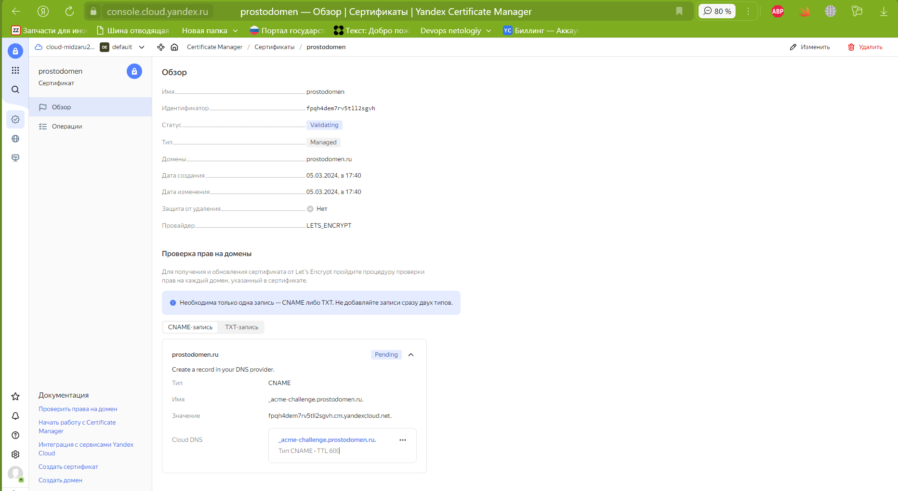
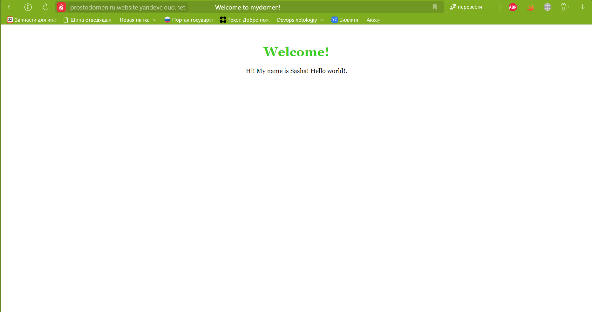

# Домашнее задание к занятию «Безопасность в облачных провайдерах»  

Используя конфигурации, выполненные в рамках предыдущих домашних заданий, нужно добавить возможность шифрования бакета.

---
## Задание 1. Yandex Cloud   

1. С помощью ключа в KMS необходимо зашифровать содержимое бакета:

 - создать ключ в KMS;
 - с помощью ключа зашифровать содержимое бакета, созданного ранее.

 [Bucket whith kms](main/bucket.tf)

<details>
<summary>terraform apply</summary>

```shell
terraform apply -auto-approve

Terraform used the selected providers to generate the following execution plan. Resource actions are indicated with the following symbols:
  + create

Terraform will perform the following actions:

  # yandex_iam_service_account.bucket-sa will be created
  + resource "yandex_iam_service_account" "bucket-sa" {
      + created_at  = (known after apply)
      + description = "service account for bucket"
      + folder_id   = (known after apply)
      + id          = (known after apply)
      + name        = "bucket-sa"
    }

  # yandex_iam_service_account_static_access_key.sa-static-key will be created
  + resource "yandex_iam_service_account_static_access_key" "sa-static-key" {
      + access_key           = (known after apply)
      + created_at           = (known after apply)
      + description          = "static access key for object storage"
      + encrypted_secret_key = (known after apply)
      + id                   = (known after apply)
      + key_fingerprint      = (known after apply)
      + secret_key           = (sensitive value)
      + service_account_id   = (known after apply)
    }

  # yandex_kms_symmetric_key.key-bucket will be created
  + resource "yandex_kms_symmetric_key" "key-bucket" {
      + created_at          = (known after apply)
      + default_algorithm   = "AES_128"
      + deletion_protection = false
      + description         = "description for key"
      + folder_id           = "b1g7uad4bpp6ioe1fc7h"
      + id                  = (known after apply)
      + name                = "symetric-key"
      + rotated_at          = (known after apply)
      + rotation_period     = "8760h"
      + status              = (known after apply)
    }

  # yandex_resourcemanager_folder_iam_member.bucket-admin will be created
  + resource "yandex_resourcemanager_folder_iam_member" "bucket-admin" {
      + folder_id = "b1g7uad4bpp6ioe1fc7h"
      + id        = (known after apply)
      + member    = (known after apply)
      + role      = "storage.admin"
    }

  # yandex_storage_bucket.vp-bucket will be created
  + resource "yandex_storage_bucket" "vp-bucket" {
      + access_key            = (known after apply)
      + acl                   = "public-read"
      + bucket                = "sasha-netology-bucket-2024"
      + bucket_domain_name    = (known after apply)
      + default_storage_class = (known after apply)
      + folder_id             = (known after apply)
      + force_destroy         = false
      + id                    = (known after apply)
      + secret_key            = (sensitive value)
      + website_domain        = (known after apply)
      + website_endpoint      = (known after apply)

      + anonymous_access_flags {
          + list = true
          + read = true
        }

      + server_side_encryption_configuration {
          + rule {
              + apply_server_side_encryption_by_default {
                  + kms_master_key_id = (known after apply)
                  + sse_algorithm     = "aws:kms"
                }
            }
        }

      + website {
          + index_document = "index.html"
        }
    }

  # yandex_vpc_network.netology-network will be created
  + resource "yandex_vpc_network" "netology-network" {
      + created_at                = (known after apply)
      + default_security_group_id = (known after apply)
      + folder_id                 = (known after apply)
      + id                        = (known after apply)
      + labels                    = (known after apply)
      + name                      = "develop"
      + subnet_ids                = (known after apply)
    }

  # yandex_vpc_subnet.public will be created
  + resource "yandex_vpc_subnet" "public" {
      + created_at     = (known after apply)
      + folder_id      = (known after apply)
      + id             = (known after apply)
      + labels         = (known after apply)
      + name           = "public-subnet"
      + network_id     = (known after apply)
      + v4_cidr_blocks = [
          + "192.168.10.0/24",
        ]
      + v6_cidr_blocks = (known after apply)
      + zone           = "ru-central1-a"
    }

Plan: 7 to add, 0 to change, 0 to destroy.
yandex_kms_symmetric_key.key-bucket: Creating...
yandex_vpc_network.netology-network: Creating...
yandex_iam_service_account.bucket-sa: Creating...
yandex_kms_symmetric_key.key-bucket: Creation complete after 0s [id=abjebnavmrg1cn1scgiq]
yandex_iam_service_account.bucket-sa: Creation complete after 2s [id=ajefs9upi3unbi7sj135]
yandex_resourcemanager_folder_iam_member.bucket-admin: Creating...
yandex_iam_service_account_static_access_key.sa-static-key: Creating...
yandex_vpc_network.netology-network: Creation complete after 3s [id=enptio4u0scfei3p8v19]
yandex_vpc_subnet.public: Creating...
yandex_iam_service_account_static_access_key.sa-static-key: Creation complete after 1s [id=ajehemvn825i65gei2s5]
yandex_storage_bucket.vp-bucket: Creating...
yandex_vpc_subnet.public: Creation complete after 1s [id=e9b42cl0220rt86m74jm]
yandex_resourcemanager_folder_iam_member.bucket-admin: Creation complete after 3s [id=b1g7uad4bpp6ioe1fc7h/storage.admin/serviceAccount:ajefs9upi3unbi7sj135]
yandex_storage_bucket.vp-bucket: Still creating... [10s elapsed]
yandex_storage_bucket.vp-bucket: Creation complete after 15s [id=sasha-netology-bucket-2024]
```


</details>


2. (Выполняется не в Terraform)* Создать статический сайт в Object Storage c собственным публичным адресом и сделать доступным по HTTPS:

Создать сертификат:



Создать статическую страницу в Object Storage и применить сертификат HTTPS:

Очень долго проходит валидация по запрашиваемому домену и соответственно выпуск сертификата от Let’s Encrypt, поэтоиу, для тестирования функциональности, создал самоподписанный сертификат и подписал им свой веб-сайт:


В качестве результата предоставить скриншот на страницу с сертификатом в заголовке (замочек):



Полезные документы:

- [Настройка HTTPS статичного сайта](https://cloud.yandex.ru/docs/storage/operations/hosting/certificate).
- [Object Storage bucket](https://registry.terraform.io/providers/yandex-cloud/yandex/latest/docs/resources/storage_bucket).
- [KMS key](https://registry.terraform.io/providers/yandex-cloud/yandex/latest/docs/resources/kms_symmetric_key).

--- 


### Правила приёма работы

Домашняя работа оформляется в своём Git репозитории в файле README.md. Выполненное домашнее задание пришлите ссылкой на .md-файл в вашем репозитории.
Файл README.md должен содержать скриншоты вывода необходимых команд, а также скриншоты результатов.
Репозиторий должен содержать тексты манифестов или ссылки на них в файле README.md.
